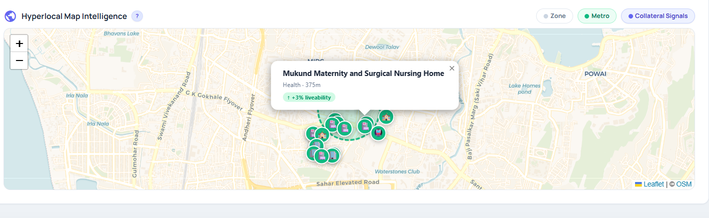

# PropScore: Collateral Valuation & Liquidity Engine

A collateral intelligence platform for property-backed lending that combines valuation, liquidity, verification, historical reliability, portfolio concentration, and AI-assisted underwriter explanation.

## Problem Statement

Property-backed lending still depends heavily on manual collateral review, branch-level judgment, and valuation reports that often stop at a price estimate. This creates avoidable underwriting risk:

- Inconsistent valuation outcomes across reviewers and locations
- Manual and slow review cycles for credit teams
- Limited visibility into resale liquidity and time-to-liquidate
- Weak confidence or uncertainty modeling around value estimates
- No portfolio-aware view of whether a new collateral increases concentration risk

## Solution Overview

PropScore turns a raw property submission into a structured collateral intelligence workflow:

```text
Raw Property Input
-> Stage 1 normalization and bucket assignment
-> Stage 2 verification and red-flag screening
-> Valuation and liquidity estimation
-> Historical reliability
-> Portfolio concentration risk
-> AI underwriter summary
-> Lender action
```

The system keeps all numeric scoring deterministic. The local LLM explains already-computed outputs and recommends evidence; it does not calculate scores or valuation.

## Key Features

- SQLite-backed Mumbai one-city data layer
- Multi-scale bucket assignment for locality, micro-market, and hyperlocal context
- Verification and anomaly screening against local market norms
- Market value and distress value estimates
- Resale potential and time-to-liquidate signals
- Historical similar cases with recency decay and severe size mismatch cap
- Portfolio concentration risk with LTV adjustment and senior review trigger
- Ollama underwriter summary and evidence recommendations
- Deterministic scoring with an audit-safe LLM boundary

## Product Screenshots

### Hyperlocal Map Intelligence



## Architecture Overview

- **Frontend:** React + Vite lender dashboard for intake, verification, valuation, historical cases, portfolio risk, and AI briefing.
- **Backend:** FastAPI service exposing SQLite-backed endpoints and the Ollama underwriter summary endpoint.
- **Database:** Local SQLite database seeded with Mumbai reference data for a complete one-city workflow.
- **LLM:** Local Ollama models for explanation-only underwriter narrative.
- **Fallbacks:** If SQLite or Ollama is unavailable, the dashboard keeps deterministic outputs visible and uses safe fallbacks.

Core backend endpoints:

- `GET /health`
- `POST /api/stage1/resolve-context`
- `POST /api/historical/similar-cases`
- `POST /api/portfolio/concentration-risk`
- `POST /api/llm/underwriter-summary`

## Database Schema Overview

- `locality_master`: Mumbai locality, micro-market, access, demand, and liquidity reference data.
- `market_norms`: Property type/subtype norms, common size bands, price bands, comparable counts, and liquidity index.
- `circle_rate_master`: Seeded circle-rate style floor-value references by zone and property type.
- `historical_cases`: Historical collateral cases used for similarity, recency decay, and confidence adjustment.
- `portfolio_exposure`: Active book exposure used for concentration risk, delinquency/default signal, and LTV review.
- `cases`: Case-level storage shape for normalized input, bucket assignment, stage outputs, and final decision.
- `valuation_outputs`: Valuation output shape for market value, distress value, confidence, and adjustments.
- `audit_logs`: Rule-level audit trail shape for score contributions and explanations.
- `geocode_cache`: Cached geocode records for common demo localities.

## Data Note / Honesty Statement

This hackathon implementation uses seeded Mumbai reference data to demonstrate the complete workflow. In deployment, these tables would be populated from public listing feeds, government/circle-rate sources, maps/POI data, and lender internal loan/portfolio systems.

This repository does not claim to include real bank data, live market data, pan-India coverage, or production valuation guarantees.

## LLM Boundary

Ollama is used for explanation, underwriter summaries, review-route wording, and evidence recommendations only.

Ollama does **not** calculate valuation, anomaly score, suspicion score, confidence score, portfolio risk score, LTV, or risk flags. All numeric scores, value estimates, LTV adjustments, and flags are computed by deterministic engines.

## Setup Instructions

Run commands from the project root:

```powershell
git clone https://github.com/sameer30mehta/demo_tensor.git
cd demo_tensor
```

Create and activate a Python virtual environment:

```powershell
python -m venv .venv
.\.venv\Scripts\Activate.ps1
python -m pip install --upgrade pip
python -m pip install -r backend\requirements-dev.txt
```

Seed the local SQLite database:

```powershell
New-Item -ItemType Directory -Force D:\PropScore\data
$env:SQLITE_DB_PATH="D:/PropScore/data/propscore.sqlite"
python backend/db/seed_sqlite.py
```

Start the backend:

```powershell
$env:SQLITE_DB_PATH="D:/PropScore/data/propscore.sqlite"
$env:OLLAMA_BASE_URL="http://127.0.0.1:11434"
$env:OLLAMA_MODEL="qwen2.5:7b"
$env:OLLAMA_FALLBACK_MODEL="llama3.2:3b"
$env:OLLAMA_FAST_MODEL="llama3.2:3b"
$env:OLLAMA_TIMEOUT_SECONDS="150"
$env:OLLAMA_FAST_TIMEOUT_SECONDS="120"
$env:LLM_DEBUG="false"
python -m uvicorn backend.main:app --reload --port 8000
```

Install and start the frontend in a second PowerShell window:

```powershell
npm install
$env:VITE_API_BASE_URL="http://127.0.0.1:8000"
npm run dev
```

Open the Vite URL shown in the terminal, usually `http://127.0.0.1:5173`.

## Ollama Setup

Ollama is optional for deterministic scoring but required for local AI underwriter summaries.

If Ollama is not already running, start the Ollama app or run `ollama serve` in a separate terminal first.

Optional D-drive model location:

```powershell
setx OLLAMA_MODELS "D:\PropScore\models\ollama"
```

Restart PowerShell after `setx`, then pull the models:

```powershell
ollama pull qwen2.5:7b
ollama pull llama3.2:3b
ollama list
```

`qwen2.5:7b` may be slow on low-RAM machines. The app supports `llama3.2:3b` as the fast/fallback model and also has a rule-based fallback if local LLM calls fail.

## Environment Variables

Copy `.env.example` values into your local environment. Do not commit actual `.env` files.

```env
SQLITE_DB_PATH=D:/PropScore/data/propscore.sqlite
OLLAMA_BASE_URL=http://127.0.0.1:11434
OLLAMA_MODEL=qwen2.5:7b
OLLAMA_FALLBACK_MODEL=llama3.2:3b
OLLAMA_FAST_MODEL=llama3.2:3b
OLLAMA_TIMEOUT_SECONDS=150
OLLAMA_FAST_TIMEOUT_SECONDS=120
LLM_DEBUG=false
VITE_API_BASE_URL=http://127.0.0.1:8000
```

## Canonical Test Case

Use this case in the intake flow:

- Address: Andheri East, Mumbai
- Property type: Residential
- Subtype: 2BHK
- Size: 200 sqft
- Age: 12 years
- Legal/title: Unknown or weak

Expected behavior:

- Stage 1: SQLite reference DB context and Andheri East bucket assignment
- Stage 2: SQLite `market_norms` and size anomaly/manual review
- Historical: SQLite similar cases with recency decay
- Portfolio: Concentration risk and LTV adjustment
- AI: Underwriter summary plus evidence recommendations

## API Endpoints

See [API_TESTS.md](./API_TESTS.md) for copy-paste PowerShell calls.

- `GET /health`: Backend health check.
- `POST /api/stage1/resolve-context`: Resolve SQLite locality, bucket, market norm, and circle-rate context.
- `POST /api/historical/similar-cases`: Retrieve and score similar historical collateral cases.
- `POST /api/portfolio/concentration-risk`: Assess portfolio concentration and recommended LTV impact.
- `POST /api/llm/underwriter-summary`: Generate explanation-only underwriter summary with Ollama and rule-based fallback.

## Known Limitations

- One-city Mumbai seeded dataset.
- Nearest-center locality matching, not polygon or parcel-level matching.
- No live paid maps/listings integration yet.
- Ollama performance depends on local RAM, CPU, and GPU availability.
- `qwen2.5:7b` may timeout on low-memory machines; `llama3.2:3b` fallback is supported.

## Future Improvements

- Polygon/H3 spatial joins
- Real listing ingestion
- Real circle-rate ingestion
- OCR/legal document extraction
- Calibration from lender historical performance
- Cloud deployment
- Portfolio-level monitoring dashboard

## Docker Note

Docker files are included as optional deployment scaffolding. The recommended hackathon demo path is local Windows setup with SQLite on disk and Ollama running on the host machine. If using Docker, mount the SQLite path and keep Ollama available at `http://127.0.0.1:11434` or an equivalent host URL.
